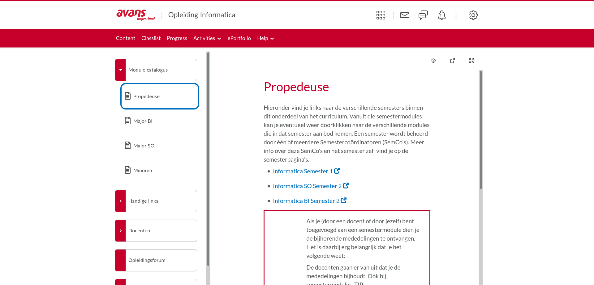
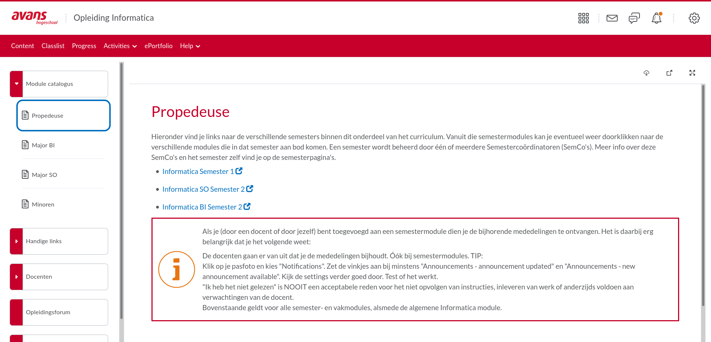

# brightspace-margin-purger

Avans brightspace rediculous margin purger Firefox addon / extension

# Installing

Go to [Releases](https://github.com/JRaams/brightspace-margin-purger/releases) and download the .zip

OR if you wish to build your own:

`npm run zip`
Creates 'web-ext-artifacts' folder containing the addon .zip

Installing:

- open firefox
- navigate to `about:debugging#/runtime/this-firefox`
- click 'Load Temporary Add-on...'
- navigate to this project directory
- select `web-ext-artifacts/brightspace-margin-purger-1.0.zip`
- done!

The addon should be visible and enabled in `about:addons` now.

# Dev

1. Install deps
   `npm install`

2. Install temporary addon

- open firefox
- navigate to about:debugging#/runtime/this-firefox
- click 'Load Temporary Add-on...'
- navigate to this project directory
- open 'manifest.json'

# Why

Large bootstrap container margin :rage:

Before:

After:

